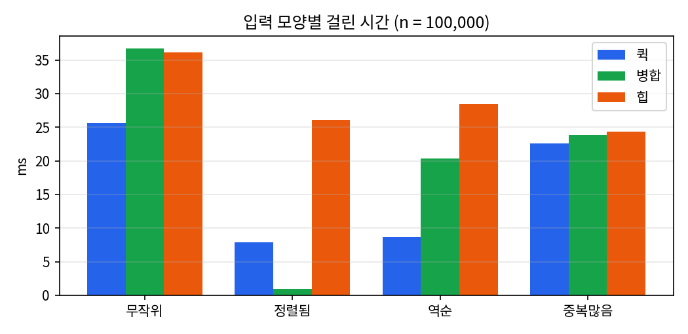
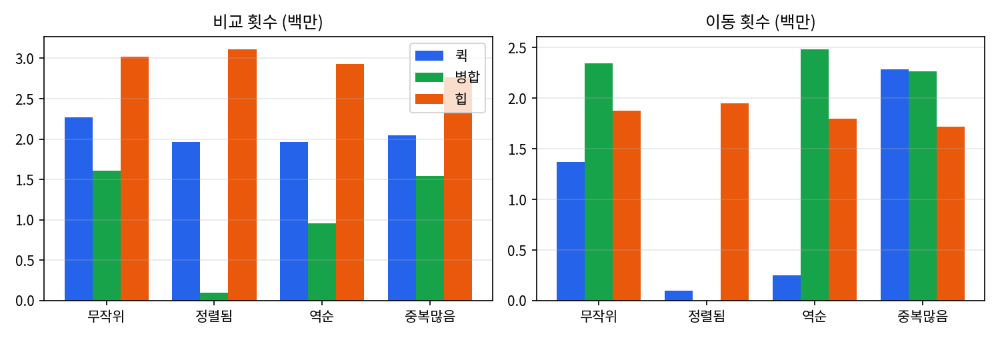
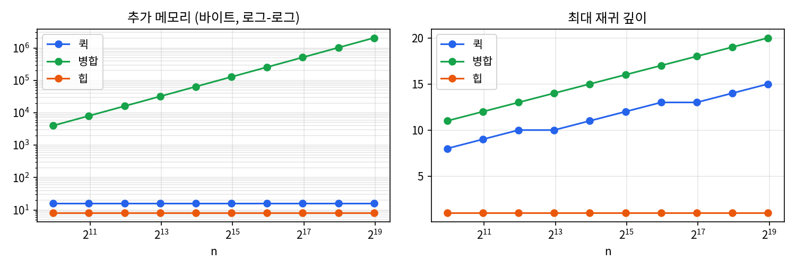
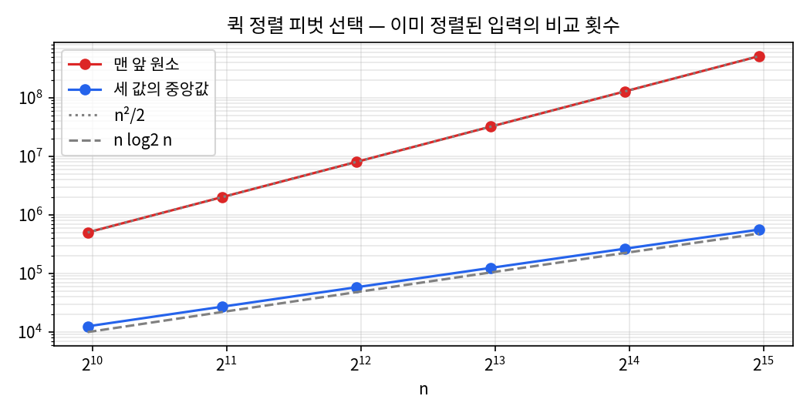

# 과제1. 정렬 비교 — 퀵 · 병합 · 힙

- 과목: 고급알고리즘 (SIT2001-01)
- 작성: 유현진 (학번 2026193208)
- 저장소: https://github.com/rikkatime/hw1-sorting
- 환경: `gcc 13.3 -std=c17 -Wall -Wextra -O2`, Linux 컨테이너 (Intel Xeon 2.1GHz, 1코어)
- 실행: `make run` (비교 표) · `make test` (유닛 테스트 56개) · `make data && make charts` (CSV · 그래프)

---

## 0. 요약

| | 퀵 정렬 | 병합 정렬 | 힙 정렬 (배우지 않은 정렬) |
|---|---|---|---|
| 평균 / 최악 시간 | O(n log n) / **O(n²)** | O(n log n) / O(n log n) | O(n log n) / O(n log n) |
| 추가 메모리 (실측, n=100,000) | 16 B + 재귀 스택 | **400,008 B** (n/2칸) | **8 B** |
| 재귀 깊이 (n=100,000, 무작위) | 13 | 18 | 1 |
| 안정성 (실측) | 불안정 | **안정** | 불안정 |
| 무작위 n=100,000 시간 | **25.6 ms** | 36.7 ms | 36.2 ms |
| 비교 횟수 ÷ n log₂n | 약 1.35 | 약 0.97 | 약 1.80 |

세 정렬은 모두 평균 O(n log n)이지만 **각자 다른 것을 포기한다.** 퀵은 최악의 경우를,
병합은 메모리를, 힙은 안정성과 캐시 효율을 내준다. 실험에서 가장 빠른 것은 비교를
가장 많이 하지 않는 퀵이었고, 비교가 가장 적은 병합은 원소 이동이 많아 시간에서 이기지
못했다. 힙은 추가 메모리 8바이트로 최악 O(n log n)을 보장하지만 n이 커질수록 캐시 때문에
뒤처졌다.

---

## 1. 비교 대상과 선정 이유

- **퀵 정렬** (배운 정렬) — 실무에서 가장 흔히 쓰는 정렬의 기반. 불안정 정렬 대표.
- **병합 정렬** (배운 정렬) — 안정 정렬이면서 최악 O(n log n). 대신 보조 배열이 필요하다.
- **힙 정렬** (배우지 않은 정렬) — 보조 배열 없이 최악 O(n log n)을 보장한다.

셋을 고른 이유는 **서로 다른 축에서 서로를 이기도록** 하기 위해서다. 시간(퀵), 안정성(병합),
메모리와 최악 보장(힙)에서 각각 우위가 갈리므로, "무엇이 가장 좋은가"가 아니라 "무엇을
얻고 무엇을 내주는가"를 비교할 수 있다. 또 안정 정렬 하나와 불안정 정렬 둘을 섞어서
안정성 열이 실제로 갈리게 했다.

---

## 2. 구현

### 2.1 공통 인터페이스

세 정렬을 같은 조건으로 재려면 호출하는 쪽 코드가 하나여야 한다. C에는 interface가
없으므로 **함수 포인터를 담은 구조체**를 인터페이스로 삼았다.

```c
/* src/sort.h */
typedef int (*SortCompare)(const void *a, const void *b);   /* qsort와 같은 규약 */

typedef struct SortAlgorithm {
    const char *name;
    const char *timeComplexity;
    const char *spaceComplexity;
    int stable;                  /* 안정 정렬이라는 "주장" — 테스트가 실측과 대조 */
    void (*sort)(void *base, size_t n, size_t size, SortCompare cmp, SortStats *stats);
} SortAlgorithm;

/* src/sort.c */
const SortAlgorithm SORT_ALGORITHMS[] = {
    {"quickSort", "O(n log n) / O(n^2)",     "O(log n)", 0, quickSort},
    {"mergeSort", "O(n log n) / O(n log n)", "O(n)",     1, mergeSort},
    {"heapSort",  "O(n log n) / O(n log n)", "O(1)",     0, heapSort},
};
```

측정 코드(`main.c`)와 테스트(`tests/test_sort.c`)는 이 표만 훑는다. 정렬 이름을 직접
부르는 곳이 없으므로 셋은 같은 입력 · 같은 시계 · 같은 검사를 받는다.

원소를 `void *`와 크기로 받는 것은 **안정성 측정의 전제**다. `int` 배열에서는 같은 값
두 개를 구별할 수 없어 안정성을 볼 수 없다.

| 파일 | 역할 |
|---|---|
| `src/sort.h` · `src/sort.c` | 공개 인터페이스, 구현 표, 공통 도구 |
| `src/sortctx.h` | 구현끼리만 쓰는 도구 (세면서 비교 · 복사 · 교환) |
| `src/quickSort.c` · `src/mergeSort.c` · `src/heapSort.c` | 알고리즘 하나씩 |
| `src/bench.c` | 입력 생성 · 시간 측정 · 정렬/안정성 판정 |
| `src/main.c` | 실험 셋을 표 또는 CSV로 출력 |
| `tests/test_sort.c` | 유닛 테스트 |
| `tools/plot.py` | CSV → 그래프(PNG) |

### 2.2 무엇을 어떻게 쟀나

| 측정값 | 방법 | 비고 |
|---|---|---|
| 시간 | `timespec_get`(C11), 배열 복사 시간은 빼고 여러 번 평균 | 기계마다 다르다 |
| 비교 · 이동 횟수 | 모든 비교 · 복사를 공통 도구가 센다 (교환 1회 = 이동 3회) | **입력이 같으면 항상 같은 값** |
| 추가 메모리 | 입력 배열 밖에 `malloc`한 바이트 | 재귀 스택은 따로(깊이) 잰다 |
| 재귀 깊이 | 재귀에 들어갈 때마다 깊이를 올려 최댓값 기록 | 스택 사용량의 대리 지표 |
| 안정성 | 원소를 `(key, tag)`로 만들고 **key만 비교**. 정렬 뒤 같은 key끼리 tag가 오름차순인지 확인 | 표의 주장이 아니라 실측 |

입력은 무작위 · 정렬됨 · 역순 · 중복많음(서로 다른 key 10개) 네 가지다. 난수는 표준
`rand()` 대신 xorshift32를 직접 구현해 **어느 기계에서나 같은 입력**이 나오게 했다.
따라서 비교 · 이동 횟수는 누가 어디서 돌려도 이 보고서와 같은 값이 나온다.

### 2.3 검증

`make test`는 정렬마다 다음을 확인한다 (총 56개 검사, 실패 0).

- 기본 케이스: 섞임, 역순, 정렬됨, 중복, 모두 같은 값, 원소 1 · 2개, 빈 배열, `INT_MIN` · `INT_MAX`
- 표준 `qsort`와 결과 대조: n = 0부터 300까지 전부, 그리고 1023 · 4096 · 10007
- 네 입력 모양 모두에서 정렬되는지
- 구현 표의 `stable` 주장이 실측과 일치하는지
- 퀵 정렬 피벗: 맨 앞 피벗 + 정렬된 입력이면 비교가 n²/2 이상, 중앙값 피벗이면 그 아래

테스트가 실제로 버그를 잡는지도 확인했다. 병합 정렬의 비교 `<`를 `<=`로 한 글자 바꾸면
결과는 여전히 오름차순이지만 **"안정성 주장 = 실측" 검사가 실패한다.** 또 AddressSanitizer ·
UndefinedBehaviorSanitizer를 붙여 돌려 경고가 없음을 확인했다(바이트 단위 포인터 연산을
쓰므로 필요하다).

---

## 3. 알고리즘 상세

### 3.1 퀵 정렬

피벗을 하나 고르고, 피벗보다 작은 원소는 왼쪽 · 큰 원소는 오른쪽으로 모은 뒤 양쪽을
각각 다시 정렬한다. 분할은 **Hoare 방식**을 썼다. 양 끝에서 안쪽으로 훑다가 왼쪽에서
피벗 이상, 오른쪽에서 피벗 이하를 만나면 둘을 맞바꾼다.

```c
for (;;) {
    while (sortCompare(c, sortElemAt(c, i), pivot) < 0) i++;
    while (sortCompare(c, sortElemAt(c, j), pivot) > 0) j--;
    if (i >= j) return j;          /* a[lo..j] <= 피벗 <= a[j+1..hi) */
    sortSwap(c, i, j);
    i++; j--;
}
```

피벗과 **같은 값에서도 멈추는 것**이 핵심이다. 같은 값이 많으면 양쪽이 번갈아 멈춰
교환하므로 가운데서 만나 반반으로 갈린다. 대신 같은 값끼리의 쓸데없는 교환이 생기는데,
이것이 5.1절에서 중복많음 입력의 이동 횟수가 늘어난 이유다.

구현에서 두 가지를 신경 썼다.

1. **피벗 선택** — 처음 · 가운데 · 끝 세 값의 중앙값을 쓴다. 맨 앞 원소를 피벗으로
   쓰면 이미 정렬된 입력에서 매번 1 : n-1로 갈라져 O(n²)가 된다(5.4절).
2. **짧은 쪽만 재귀** — 두 부분 중 짧은 쪽만 재귀 호출하고 긴 쪽은 반복문으로 처리한다.
   짧은 쪽은 항상 절반 이하이므로 재귀 깊이가 log₂n을 넘지 않는다. 단, 이것은 **스택만**
   지켜 줄 뿐 시간의 최악 O(n²)까지 막지는 못한다(5.4절에서 확인).

떨어진 두 원소를 맞바꾸므로 같은 값의 순서가 뒤바뀔 수 있어 **불안정**하다.

### 3.2 병합 정렬

배열을 반으로 나눠 각각 정렬한 뒤, 정렬된 두 쪽을 앞에서부터 비교하며 합친다. 나누는
깊이가 log₂n, 각 깊이에서 합치는 일이 n이므로 입력 모양과 상관없이 O(n log n)이다.

```c
/* 오른쪽이 "더 작을 때만" 오른쪽을 가져온다. 같으면 왼쪽이 먼저 → 안정 */
if (sortCompare(c, sortElemAt(c, j), aux + i * c->size) < 0)
    sortMove(c, sortElemAt(c, k++), sortElemAt(c, j++));
else
    sortMove(c, sortElemAt(c, k++), aux + (i++) * c->size);
```

같은 값이면 왼쪽(원래 앞에 있던 것)을 먼저 내보내므로 **안정 정렬**이다. 2.3절의 변이
테스트가 바로 이 `<`를 `<=`로 바꾼 것이다.

두 가지를 손봤다.

1. **보조 배열을 n/2만 잡는다.** 합칠 때 왼쪽 절반만 보조 배열로 빼 두고, 결과는 원래
   배열 앞에서부터 채운다. 결과를 쓰는 자리는 아직 읽지 않은 오른쪽 원소를 절대 앞지르지
   않으므로 오른쪽은 제자리에 둬도 된다. 그래서 n=100,000에서 추가 메모리가
   800,000 B가 아니라 400,008 B다.
2. **이미 이어져 있으면 합치지 않는다.** 왼쪽의 마지막 ≤ 오른쪽의 첫 원소이면 합칠 필요가
   없다. 정렬된 입력에서 비교 n-1번 · 이동 0번으로 끝난다(5.1절).

---

## 4. 배우지 않은 정렬: 힙 정렬 — AI를 통한 학습 기록

수업에서 다루지 않은 힙 정렬은 AI(Claude)에게 질문하며 학습했다. 아래는 질문과, 답을
듣고 이해한 내용을 정리한 것이다. 이해한 내용은 직접 구현(`src/heapSort.c`)과 실험으로
확인했다.

**Q1. 힙이 무엇이고, 트리를 어떻게 배열에 담는가?**

최대 힙은 **모든 부모가 자식보다 크거나 같은 완전 이진 트리**다. 그래서 루트가 항상
최댓값이다. 완전 이진 트리는 빈틈 없이 왼쪽부터 채워지므로 포인터 없이 배열 인덱스만으로
표현된다.

- `i`의 자식: `2i+1`, `2i+2`    · `i`의 부모: `(i-1)/2`

즉, 정렬할 배열 자체를 트리로 "해석"할 뿐 새 자료구조를 만들지 않는다. 이것이 추가
메모리가 O(1)인 이유다.

**Q2. 힙 정렬은 어떻게 동작하는가?**

1. **힙 만들기(heapify)** — 마지막 부모(`n/2-1`)부터 루트까지 거꾸로 내려오며, 각 원소를
   자식보다 작으면 아래로 내려 보낸다(sift-down).
2. **추출** — 루트(최댓값)를 배열 맨 끝과 바꾸고, 힙 크기를 하나 줄인 뒤, 새 루트를
   다시 내려 보낸다. 이것을 n-1번 반복하면 배열 뒤쪽부터 큰 값이 채워진다.

`[4, 10, 3, 5, 1]`로 직접 따라가 보았다.

| 단계 | 배열 | 설명 |
|---|---|---|
| 시작 | `[4, 10, 3, 5, 1]` | |
| heapify | `[10, 5, 3, 4, 1]` | 4가 10 → 5 자리를 거쳐 아래로 내려감 |
| 추출 1 | `[5, 4, 3, 1, │ 10]` | 10을 끝으로, 1을 루트에서 내려 보냄 |
| 추출 2 | `[4, 1, 3, │ 5, 10]` | |
| 추출 3 | `[3, 1, │ 4, 5, 10]` | |
| 추출 4 | `[1, │ 3, 4, 5, 10]` | 완료 |

**Q3. 힙 만들기는 왜 O(n log n)이 아니라 O(n)인가?**

원소 n개를 각각 최대 log n만큼 내려 보내니 O(n log n)처럼 보인다. 하지만 **아래쪽일수록
원소는 많고 내려갈 거리는 짧다.** 원소의 절반인 잎은 한 칸도 내려가지 않고, 그 위 1/4은
최대 1칸, 그 위 1/8은 최대 2칸이다. 합하면 n · (1/4 + 2/8 + 3/16 + …) ≤ n 이므로 O(n)이다.
전체 시간은 추출 단계의 O(n log n)이 결정한다.

**Q4. 왜 불안정한가?** — 추출할 때 루트를 **멀리 떨어진 배열 끝**으로 보내기 때문이다.
`[5a, 5b, 3]`을 정렬하면 `[3, 5b, 5a]`가 되어 같은 5의 순서가 뒤집힌다. 실험에서도 중복이
있는 입력마다 불안정으로 측정되었다(5.3절).

**Q5. 최악도 O(n log n)이고 메모리도 적은데, 왜 퀵 정렬보다 덜 쓰이는가?**

- 비교 횟수가 많다. 매 단계 두 자식 중 큰 쪽을 고르는 비교와, 그것을 내려 보낼 값과
  견주는 비교가 둘씩 든다. 실측으로 퀵의 약 1.3배, 병합의 약 1.9배였다(5.2절).
- **캐시 효율이 나쁘다.** 부모 `i`와 자식 `2i+1`은 배열에서 멀리 떨어져 있어, n이 크면
  한 번 내려갈 때마다 서로 다른 메모리 구역을 건너뛴다. 퀵과 병합은 배열을 앞에서 뒤로
  훑으므로 캐시에 유리하다. 5.2절에서 n이 커질수록 힙이 퀵에 비해 더 느려지는 것이
  이 효과다.

**Q6. 그러면 실제로는 어디에 쓰이는가?**

- **인트로 정렬(introsort)** — C++ `std::sort` 등은 기본적으로 퀵 정렬을 쓰다가, 재귀가
  너무 깊어지면(최악으로 가고 있다는 신호) 힙 정렬로 바꾼다. 퀵의 평균 속도와 힙의
  최악 보장을 합친 것이다.
- **우선순위 큐** — 정렬 전체가 아니라 "지금 가장 큰 것 하나"만 반복해서 꺼낼 때 쓴다.
  작업 스케줄러, 다익스트라 최단 경로 등.
- **상위 k개 찾기** — 크기 k의 힙을 유지하면 O(n log k)로 끝난다.

**직접 구현에서 적용한 것:** 내려 보낼 때 매번 교환(이동 3회)하는 대신, 내려 보낼 값을
임시 칸에 들고 있고 **자식을 한 칸씩 끌어올린 뒤 마지막에 한 번만 놓는다**(구멍 내려
보내기). 한 단계당 이동이 3회에서 1회로 준다.

---

## 5. 실험 결과

아래 수치는 `make data`를 한 번 실행한 결과이며 원본은 `report/data/*.csv`에 있다.
시간은 실행할 때마다 조금씩 달라지지만, 비교 · 이동 횟수는 입력이 고정이라 항상 같다.

### 5.1 입력 모양별 (n = 100,000)

| 입력 | 알고리즘 | 시간(ms) | 비교 | 이동 | 깊이 | 안정성 |
|---|---|---:|---:|---:|---:|---|
| 무작위 | quick | **25.6** | 2,265,721 | 1,370,583 | 13 | 불안정 |
| 무작위 | merge | 36.7 | **1,605,837** | 2,345,365 | 18 | 안정 |
| 무작위 | heap | 36.2 | 3,019,903 | 1,875,422 | 1 | 불안정 |
| 정렬됨 | quick | 7.9 | 1,965,532 | 99,999 | 17 | – |
| 정렬됨 | merge | **0.9** | **99,999** | **0** | 18 | – |
| 정렬됨 | heap | 26.1 | 3,112,517 | 1,950,852 | 1 | – |
| 역순 | quick | **8.7** | 1,965,533 | 250,005 | 17 | – |
| 역순 | merge | 20.3 | **953,903** | 2,483,952 | 18 | – |
| 역순 | heap | 28.4 | 2,926,640 | 1,797,432 | 1 | – |
| 중복많음 | quick | **22.6** | 2,050,042 | 2,283,279 | 16 | 불안정 |
| 중복많음 | merge | 23.9 | **1,545,865** | 2,267,636 | 18 | 안정 |
| 중복많음 | heap | 24.3 | 2,762,001 | 1,717,982 | 1 | 불안정 |

(정렬됨 · 역순은 key가 모두 달라 어떤 정렬이든 안정으로 나오므로 안정성을 비워 두었다.)





관찰한 것:

- **비교가 적다고 빠른 것은 아니다.** 무작위 입력에서 병합은 비교가 가장 적지만
  (퀵의 71%), 이동이 퀵의 1.7배라 시간은 1.4배 더 걸렸다. 병합은 매번 보조 배열로
  복사하고 되돌려 놓기 때문이다.
- **병합은 이미 정렬된 입력에 강하다.** "이미 이어져 있으면 합치지 않는다" 덕분에 비교
  n-1번 · 이동 0번으로 0.9 ms에 끝났다. 역순에서도 비교가 절반 정도로 줄었는데, 오른쪽
  절반이 통째로 먼저 나가고 왼쪽은 비교 없이 복사되기 때문이다.
- **퀵은 정렬됨 · 역순에서 오히려 빨라진다.** 세 값의 중앙값이 정확히 가운데 값이 되어
  완벽하게 반반으로 갈리기 때문이다. 정렬된 입력에서 이동 99,999회는 전부 피벗 값을
  복사해 둔 것이고 교환은 한 번도 일어나지 않았다.
- **힙은 입력 모양을 거의 타지 않는다.** 네 입력 모두 24~36 ms 범위에 있다. 정렬된
  입력에서도 힙을 만드는 순간 순서가 뒤섞이므로 이득을 보지 못한다. 좋게 말하면
  예측 가능하고, 나쁘게 말하면 쉬운 입력에서도 쉬게 되지 않는다.
- **퀵은 중복이 많을 때 이동이 늘어난다**(무작위 1.37M → 2.28M). Hoare 분할이 피벗과
  같은 값에서도 멈춰 교환하기 때문이다. 이 교환이 없으면(피벗과 같은 값을 한쪽으로만
  몰면) 분할이 한쪽으로 쏠려 O(n²)에 가까워진다. 이동 횟수를 조금 더 쓰는 대신 균형을
  지킨 것이다.

### 5.2 n을 키우며 (무작위, n = 1,000 ~ 512,000)

| n | quick(ms) | merge(ms) | heap(ms) | heap ÷ quick |
|---:|---:|---:|---:|---:|
| 1,000 | 0.155 | 0.176 | 0.191 | 1.23 |
| 8,000 | 1.546 | 1.930 | 2.014 | 1.30 |
| 64,000 | 16.90 | 19.28 | 19.50 | 1.15 |
| 512,000 | **134.7** | 187.0 | 209.9 | **1.56** |


- 로그-로그 그래프(왼쪽)에서 셋 모두 기울기가 약 1인 직선이다. n이 두 배가 되면 시간도
  두 배 조금 넘게 늘어나는, O(n log n)의 모양이다.
- 오른쪽은 비교 횟수를 n log₂n으로 나눈 값이다. 셋 다 **거의 수평**이므로 비교 횟수가
  정확히 n log n에 비례한다는 뜻이고, 그 높이가 상수 계수다: 병합 ≈ 0.97, 퀵 ≈ 1.35,
  힙 ≈ 1.80.
- 그런데 시간 순위는 비교 횟수 순위와 다르다(퀵 < 병합 < 힙). 표의 마지막 열처럼
  힙과 퀵의 격차는 n = 64,000까지 1.15~1.30배로 비슷하다가 **n = 512,000에서 1.56배로
  가장 크게 벌어졌다.** 배열(4 MB)이 캐시에 다 들어가지 않게 되면서, 부모-자식 사이를
  멀리 뛰어다니는 힙이 캐시를 놓치는 비용을 더 크게 치르는 것으로 보인다(4장 Q5).
  다만 캐시 적중률을 직접 잰 것은 아니므로 추정이다.

### 5.3 메모리 · 재귀 깊이 · 안정성



| 알고리즘 | 추가 메모리 (n = 512,000) | 재귀 깊이 (n = 512,000) | 안정성 (실측) |
|---|---:|---:|---|
| quick | 16 B (임시 칸 + 피벗 칸) | 15 | 불안정 |
| merge | 2,048,008 B (≈ n/2칸) | 20 | **안정** |
| heap | **8 B** (임시 칸) | **1** | 불안정 |

- 병합의 추가 메모리만 n에 비례해 직선으로 올라간다. 이것이 병합이 안정성과 최악 보장을
  얻는 대가다.
- 퀵은 `malloc`한 메모리는 16 B지만, 재귀 스택이 따로 든다. 짧은 쪽만 재귀한 덕분에
  깊이가 15 ≤ log₂(512,000) ≈ 19 로 묶여 있다.
- 힙만 재귀도 보조 배열도 없다. **스택까지 포함해 진짜 O(1)인 것은 힙뿐이다.**
- 안정성은 중복이 있는 입력(무작위 · 중복많음)에서 표의 주장과 실측이 정확히 일치했다.
  참고로 n = 1,000 무작위에서는 퀵과 힙도 "안정"으로 나왔는데, key 범위(100만)에 비해
  원소가 적어 우연히 같은 key가 거의 없었기 때문이다. **안정성은 중복이 충분한
  입력에서만 제대로 잴 수 있다.**

### 5.4 추가 실험: 퀵 정렬의 피벗 선택

퀵 정렬의 최악이 실제로 O(n²)인지, 이미 정렬된 입력에서 피벗을 "맨 앞 원소"로 둔 경우와
"세 값의 중앙값"으로 둔 경우를 비교했다.

| n | 맨 앞 비교 | 중앙값 비교 | 맨 앞(ms) | 중앙값(ms) | 맨 앞 깊이 |
|---:|---:|---:|---:|---:|---:|
| 1,000 | 501,498 | 12,508 | 1.46 | 0.06 | 2 |
| 4,000 | 8,005,998 | 58,044 | 23.5 | 0.25 | 2 |
| 16,000 | 128,023,998 | 264,188 | 376.5 | 1.11 | 2 |
| 32,000 | 512,047,998 | 560,380 | **1,557.8** | **2.34** | 2 |



- 맨 앞 피벗의 비교 횟수는 점선 n²/2 위에 정확히 올라간다. n = 1,000에서 501,498 ≈
  1000²/2이다. n = 32,000에서는 중앙값 피벗보다 **약 670배** 느렸다.
- 흥미로운 것은 **재귀 깊이가 2에 머문다는 점**이다. 매번 1 : n-1로 갈라지지만, 짧은
  쪽(원소 1개)만 재귀하고 긴 쪽은 반복문으로 돌기 때문이다. 짧은 쪽 재귀는 스택
  넘침을 막아 줄 뿐, 시간의 최악은 전혀 막지 못한다는 것을 보여 준다.
- 중앙값 피벗도 완벽한 해결책은 아니다. 중앙값을 속이도록 일부러 만든 입력에서는 여전히
  O(n²)가 될 수 있다. 그래서 실제 라이브러리는 4장 Q6의 인트로 정렬처럼 재귀가 깊어지면
  힙 정렬로 바꿔 최악을 막는다.

---

## 6. 결론

| 이런 상황이면 | 고를 정렬 | 근거 |
|---|---|---|
| 일반적인 경우, 가장 빠르게 | 퀵 | 무작위 입력에서 가장 빠름 (5.1, 5.2) |
| 같은 값의 순서를 지켜야 할 때 | 병합 | 유일한 안정 정렬 (5.3) |
| 이미 거의 정렬된 데이터 | 병합 | 정렬된 입력에서 비교 n-1번 (5.1) |
| 메모리가 매우 부족하거나 최악 시간을 반드시 보장해야 할 때 | 힙 | 추가 8 B · 재귀 없음 · 항상 O(n log n) (5.3) |

같은 O(n log n)이라도 **상수 계수(비교 · 이동 횟수)와 메모리 접근 방식**에 따라 실제 속도는
1.5배 가까이 차이 났다. 복잡도 표기만으로는 정렬을 고를 수 없고, 입력의 성질과 무엇을
보장해야 하는지를 함께 봐야 한다.

### 한계

- 시간은 컨테이너 한 대(1코어)에서 잰 값이다. 다른 기계에서는 절대값이 달라지므로 비교 ·
  이동 횟수를 함께 제시했다.
- 원소가 8바이트 `Record`로 작다. 원소가 크면 이동 비용이 커져 이동이 많은 병합이 더
  불리해질 것으로 예상되지만 재지 않았다.
- 퀵 정렬을 무너뜨리는 "중앙값 킬러" 입력은 만들어 보지 않았다.
- 퀵 정렬의 재귀 스택은 깊이로만 쟀고, 바이트로 환산해 추가 메모리에 더하지 않았다.
