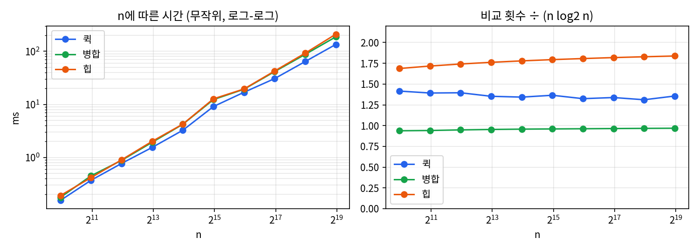

# 과제1. 정렬 비교 — 퀵 · 병합 · 힙

- 과목: 고급알고리즘 (SIT2001-01) · 작성: 유현진 (학번 2026193208)
- 저장소: https://github.com/rikkatime/hw1-sorting
- 환경: `gcc 13.3 -std=c17 -O2`, Linux 컨테이너 (Intel Xeon 2.1GHz, 1코어)
- 실행: `make run` (비교 표) · `make test` (유닛 테스트) · `make heap-exp` (힙 실험) · `make data && make charts` (그래프)

## 0. 요약

| | 퀵 정렬 | 병합 정렬 | 힙 정렬 (배우지 않은 정렬) |
|---|---|---|---|
| 평균 / 최악 시간 | O(n log n) / **O(n²)** | O(n log n) / O(n log n) | O(n log n) / O(n log n) |
| 추가 메모리 (n=100,000) | 16 B + 재귀 스택 | **400,008 B** | **8 B** |
| 안정성 (실측) | 불안정 | **안정** | 불안정 |
| 무작위 n=100,000 시간 | **25.6 ms** | 36.7 ms | 36.2 ms |
| 비교 횟수 ÷ n log₂n | 약 1.35 | 약 0.97 | 약 1.80 |

세 정렬은 모두 평균 O(n log n)이지만 각자 다른 것을 내준다. 퀵은 최악의 경우를, 병합은 메모리를,
힙은 안정성과 캐시 효율을 내준다. 비교 대상은 이 차이가 드러나도록 골랐다. 시간(퀵), 안정성(병합),
메모리와 최악 보장(힙)에서 각각 우위가 갈리고, 안정 정렬 하나와 불안정 정렬 둘이 섞여 안정성도
실제로 비교된다.

## 1. 구현과 측정 방법

세 정렬을 같은 조건으로 재기 위해 **함수 포인터를 담은 구조체**(`SortAlgorithm`)를 공통 인터페이스로
삼고, 세 구현을 표 하나(`SORT_ALGORITHMS`)에 모았다. 측정 코드와 테스트는 이 표만 훑으므로 셋은
같은 입력 · 같은 시계 · 같은 검사를 받는다. 원소는 `qsort`처럼 `void *`와 비교 함수로 받는다.

- **시간**: C11 `timespec_get`, 배열 복사는 빼고 여러 번 평균. 기계마다 다르므로 아래를 함께 셌다.
- **비교 · 이동 횟수**: 모든 비교와 원소 복사를 공통 도구가 센다(교환 1회 = 이동 3회).
- **추가 메모리 · 재귀 깊이**: 입력 밖에 `malloc`한 바이트, 재귀 깊이의 최댓값.
- **안정성**: 원소를 `(key, tag)`로 만들고 key만 비교해 정렬한 뒤, 같은 key끼리 tag 순서가 남았는지 확인.

입력은 무작위 · 정렬됨 · 역순 · 중복많음(key 10종류) 네 가지이고, 난수는 xorshift32를 직접 구현해
어느 기계에서나 같은 입력이 나온다. 그래서 비교 · 이동 횟수는 누가 돌려도 이 보고서와 같다.

**검증.** `make test`는 정렬마다 기본 케이스, 표준 `qsort`와의 대조(n = 0~300 전부와 몇 개의 큰 n),
네 입력 모양, 안정성 선언값과 실측값의 일치를 확인한다(56개 검사, 실패 0). 병합 정렬의 `<`를 `<=`로
한 글자 바꾸면 정렬 결과는 멀쩡해도 안정성 검사가 실패하는 것으로 테스트가 실제로 버그를 잡음을
확인했고, AddressSanitizer로 메모리 오류가 없음도 확인했다.

## 2. 퀵 정렬과 병합 정렬

**퀵 정렬**은 피벗보다 작은 원소를 왼쪽, 큰 원소를 오른쪽으로 모은 뒤 양쪽을 다시 정렬한다. 분할은
양 끝에서 안쪽으로 훑으며 맞바꾸는 Hoare 방식을 썼고, 피벗과 같은 값에서도 멈추게 해 중복이 많아도
반반으로 갈리게 했다. 피벗은 처음 · 가운데 · 끝 세 값의 중앙값을 쓴다(맨 앞 원소를 쓰면 정렬된
입력에서 O(n²), 5.4절). 또 짧은 쪽만 재귀하고 긴 쪽은 반복문으로 돌려 재귀 깊이를 log₂n 이하로
묶었다. 떨어진 원소를 맞바꾸므로 불안정하다.

**병합 정렬**은 반으로 나눠 정렬한 뒤 두 쪽을 앞에서부터 비교하며 합친다. 같은 값이면 왼쪽을 먼저
내보내므로 안정하다. 합칠 때 왼쪽 절반만 보조 배열로 빼 두면 되므로 보조 배열을 n이 아니라 n/2만
잡았고, 두 쪽이 이미 이어져 있으면(왼쪽 끝 ≤ 오른쪽 처음) 합치지 않게 해 정렬된 입력에서 비교
n−1번으로 끝나게 했다.

---

## 4. 배우지 않은 정렬: 힙 정렬 (AI를 통한 학습)

힙 정렬은 수업에서 다루지 않아 AI(Claude)에게 질문하며 학습했다. 질문하고 답을 들은 뒤에는
그 내용을 직접 구현(`src/heapSort.c`)해 보고, 답변에 나온 주장 가운데 숫자로 확인할 수 있는 것은
실험(`experiments/heapVariants.c`, `make heap-exp`)으로 확인했다. 이 장은 그렇게 이해한 내용을
정리한 것이고, 질문 순서와 확인 방법은 부록 A에 따로 첨부했다.

### 4.1 힙이라는 자료구조

**완전 이진 트리**는 마지막 층을 뺀 모든 층이 꽉 차 있고, 마지막 층은 왼쪽부터 채워진 이진
트리다. 여기에 모든 부모가 자식보다 크거나 같다는 조건(**힙 성질**)을 더한 것이 **최대 힙**이다.
부모가 항상 자식 이상이므로 루트가 전체의 최댓값이 된다.

주의할 점은 힙이 정렬된 상태가 아니라는 것이다. 힙 성질은 부모와 자식 사이의 관계만 정할 뿐,
형제끼리나 다른 가지끼리의 순서는 정하지 않는다. 예를 들어 `[10, 5, 3, 4, 1]`은 최대 힙이지만
정렬되어 있지 않다. 힙은 최댓값 하나만 빠르게 알려 주는, 정렬보다 느슨한 구조다.

완전 이진 트리는 빈칸 없이 층 순서대로 채워지므로 **포인터 없이 배열에 그대로 담을 수 있다.**
층마다 왼쪽부터 번호를 매기면 깊이 d의 첫 노드는 인덱스 2^d − 1이고, 이 규칙에서 다음 공식이 나온다.

- 인덱스 i의 왼쪽 자식은 2i + 1, 오른쪽 자식은 2i + 2
- 인덱스 i의 부모는 (i − 1) / 2 (정수 나눗셈)

```text
배열: [10, 5, 3, 4, 1]           트리로 보면:
인덱스  0  1  2  3  4                    10 (0)
                                      /       \
0의 자식 = 1, 2                    5 (1)      3 (2)
1의 자식 = 3, 4                   /    \
                              4 (3)   1 (4)
```

즉, 정렬할 배열 자체를 트리로 간주할 뿐 새 자료구조를 만들지 않는다. 힙 정렬의 추가 메모리가
O(1)인 이유가 이것이다. 원소가 n개인 완전 이진 트리의 높이는 ⌊log₂n⌋이며, 뒤에 나오는
모든 시간 분석이 이 높이에서 출발한다.

### 4.2 핵심 연산: 아래로 내려 보내기(sift-down)

힙 정렬의 모든 단계는 sift-down 하나로 이루어진다. 어떤 노드 i의 두 서브트리가 이미 힙일 때,
i에 놓인 값만 힙 성질을 어기고 있다면 그 값을 알맞은 자리까지 내려 보내 전체를 힙으로 만든다.

1. i의 두 자식 중 더 큰 자식을 고른다. (비교 1회)
2. 그 자식이 i의 값보다 크지 않으면 멈춘다. (비교 1회)
3. 크다면 둘의 자리를 바꾸고, 내려간 자리에서 1번부터 반복한다.

더 큰 자식과 바꾸는 이유는 바꾼 뒤에 새 부모가 다른 쪽 자식보다도 커야 하기 때문이다. 작은 쪽과
바꾸면 올라간 값이 다른 자식보다 작아져 힙 성질이 다시 깨진다. 한 층 내려갈 때마다 비교가
최대 2회이고 트리 높이가 ⌊log₂n⌋이므로, sift-down 한 번의 비용은 O(log n)이다.

예를 들어 `[4, 10, 3, 5, 1]`의 루트 4는 큰 자식 10과, 이어서 큰 자식 5와 바뀌어 `[10, 5, 3, 4, 1]`이 된다.

반대 방향 연산인 sift-up(위로 올리기)은 새 원소를 맨 끝에 넣고 부모보다 크면 부모와 바꾸기를
반복한다. 우선순위 큐에 원소를 넣을 때 쓰이며, 4.3절의 두 번째 힙 만들기 방법이 이것을 쓴다.

### 4.3 1단계: 힙 만들기와 O(n)의 이유

정렬할 배열을 먼저 최대 힙으로 바꿔야 한다. 방법은 두 가지가 있다.

- **하나씩 삽입하기:** 앞에서부터 원소를 하나씩 힙에 넣고 sift-up한다.
- **바닥부터 만들기(Floyd의 방법):** 마지막 부모 n/2 − 1부터 루트 쪽으로 거꾸로 올라가며
  각 노드를 sift-down한다. 아래쪽 서브트리가 먼저 힙이 되므로 sift-down의 전제가 항상 성립한다.

처음에는 원소 n개를 각각 최대 log n만큼 옮기므로 둘 다 O(n log n)이라고 생각했다. 그런데
바닥부터 만들기는 **O(n)** 이다. 핵심은 **아래쪽일수록 노드는 많고 내려갈 거리는 짧다**는 것이다.

- 전체의 절반인 잎은 자식이 없어 아예 건너뛴다.
- 그 위 n/4개는 최대 1층, 그 위 n/8개는 최대 2층만 내려간다.
- 높이 h에 있는 노드는 많아야 n/2^(h+1)개이고 각각 최대 h층 내려가므로 전체 이동 거리는
  n · (1/4 + 2/8 + 3/16 + 4/32 + …) = n · Σ h/2^(h+1) = n 이다.

거리가 먼 노드(루트 근처)는 몇 개 되지 않고, 대부분의 노드는 바닥 근처에서 거의 움직이지 않는다.
반대로 하나씩 삽입하기는 **나중에 들어오는 원소일수록 깊은 곳에서 출발해 멀리 올라간다.** 원소의
절반이 잎에 들어가므로 최악에는 대부분이 log n만큼 올라가 O(n log n)이 된다. 오름차순 입력이
그 최악이다. 새로 넣는 원소가 늘 지금까지 중 가장 커서 매번 루트까지 올라가기 때문이다.

이 설명이 맞는지 두 방법의 비교 횟수를 n으로 나눠 재 보았다(`make heap-exp`).

| n | 바닥부터 · 무작위 | 바닥부터 · 정렬됨 | 삽입 · 무작위 | 삽입 · 정렬됨 |
|---:|---:|---:|---:|---:|
| 1,000 | 1.85n | 1.98n | 2.19n | 7.99n |
| 10,000 | 1.88n | 2.00n | 2.29n | 11.36n |
| 100,000 | 1.88n | 2.00n | 2.29n | 14.69n |
| 1,000,000 | 1.88n | 2.00n | 2.28n | **17.95n** |

바닥부터 만들기는 n이 1,000배 커져도 비교 횟수가 2n 근처에 머문다. O(n)이라는 뜻이다. 하나씩
삽입하기는 정렬된 입력에서 비교 횟수가 n log₂n처럼 커지며 늘어난다(log₂n이 10에서 20으로 늘 때
약 8n에서 18n으로 증가). 무작위 입력에서 삽입 방식도 2.3n 정도로 평평한 것은 평균적으로는
원소가 멀리 올라가지 않기 때문인데, 이 부분은 AI의 답변을 듣고 알게 된 것으로 직접 증명하지는 못했다.

### 4.4 2단계: 추출과 전체 과정

힙이 만들어지면 루트에 최댓값이 있다. 이것을 배열의 맨 끝으로 보내면 그 자리가 최종 자리로
확정된다. 그다음 힙의 크기를 하나 줄이고, 끝에서 루트로 올라온 원소를 sift-down해 다시 힙을
만든다. 이것을 n − 1번 반복한다.

```text
heapSort(a, n):
    for i = n/2 - 1 down to 0:  siftDown(a, i, n)      // 1단계: 힙 만들기 O(n)
    for end = n - 1 down to 1:                         // 2단계: 추출 O(n log n)
        swap(a[0], a[end])        // 최댓값을 확정 자리로
        siftDown(a, 0, end)       // 남은 a[0..end)를 다시 힙으로
```

반복하는 동안 배열은 늘 두 구역으로 나뉜다. 앞쪽 `a[0..end)`는 최대 힙이고, 뒤쪽 `a[end..n)`은
이미 정렬이 끝난 큰 값들이다. 매 반복마다 경계가 한 칸씩 앞으로 오며, 경계가 0에 닿으면 정렬이
끝난다. 선택 정렬이 매번 최댓값을 훑어서 찾는(O(n)) 것과 구조가 같고, 그 찾기를 힙으로
O(log n)에 해내는 것이 차이다. 그래서 힙 정렬을 개선된 선택 정렬로 볼 수 있다.

`[4, 10, 3, 5, 1]`로 전체 과정을 따라가 보았다(│ 오른쪽이 확정된 구역).

| 단계 | 배열 | 설명 |
|---|---|---|
| 시작 | `[4, 10, 3, 5, 1]` | |
| 힙 만들기 | `[10, 5, 3, 4, 1]` | 인덱스 1(10)은 이미 제자리, 인덱스 0(4)을 내려 보냄 |
| 추출 1 | `[5, 4, 3, 1, │ 10]` | 10을 끝으로, 올라온 1을 내려 보냄 |
| 추출 2 | `[4, 1, 3, │ 5, 10]` | 5를 확정 |
| 추출 3 | `[3, 1, │ 4, 5, 10]` | 4를 확정 |
| 추출 4 | `[1, │ 3, 4, 5, 10]` | 3을 확정, 남은 1도 제자리 |

### 4.5 복잡도 분석

**시간.** 1단계는 O(n)이고, 2단계는 크기 n−1, n−2, …, 1인 힙에서 sift-down을 한 번씩 하므로
log(n−1) + log(n−2) + … = O(n log n)이다. 합하면 O(n log n)이고, 이것이 **최선 · 평균 · 최악
모두 같다.** 끝에서 루트로 올라오는 원소는 대개 작은 값이라 거의 매번 바닥 근처까지 내려가기 때문에,
입력이 어떻든 추출 단계의 일이 줄지 않는다. 퀵 정렬처럼 운 나쁜 입력으로 무너지지도 않지만,
병합 정렬처럼 이미 정렬된 입력에서 이득을 보지도 않는다.

실측으로 확인한 것:

- 무작위 n = 100,000에서 비교 3,019,903회 가운데 힙 만들기가 약 18만 회(약 6%)이고 나머지
  94%가 추출 단계였다. 시간을 결정하는 것은 2단계라는 분석과 맞는다.
- 한 층에 비교가 최대 2회이므로 이론상 상한은 약 2n log₂n이다. 실측 비교 횟수는 1.80n log₂n(5.2절)으로
  상한보다 조금 낮은데, 추출이 진행될수록 힙이 작아져 내려갈 층이 줄기 때문이다.
- 이미 정렬된 입력(3,112,517회)이 무작위(3,019,903회)보다 오히려 비교가 많았다. 오름차순
  배열은 최대 힙과 정반대 모양이라 힙을 만들 때 거의 모든 부모가 끝까지 내려가야 한다.

**공간.** 재귀를 쓰지 않고 보조 배열도 없으며, 내려 보낼 값을 담는 임시 칸 하나(8 B)만 쓴다.
스택까지 포함해 O(1)이다. 병합 정렬(O(n))과 퀵 정렬(재귀 스택 O(log n))에는 없는 성질이다.

### 4.6 불안정한 이유

추출할 때 루트의 값을 **멀리 떨어진 배열 끝**으로 보내므로, 같은 값끼리의 원래 순서가 뒤바뀔 수
있다. `[5a, 5b, 3]`(같은 5를 a, b로 구분)을 정렬해 보면 다음과 같다.

| 단계 | 배열 | 설명 |
|---|---|---|
| 힙 만들기 | `[5a, 5b, 3]` | 루트 5a가 자식 5b보다 작지 않으므로 그대로 |
| 추출 1 | `[5b, 3, │ 5a]` | 5a가 끝으로 가고, 올라온 3을 내려 보내며 5b가 루트로 |
| 추출 2 | `[3, │ 5b, 5a]` | 5b가 확정 |

결과 `[3, 5b, 5a]`에서 5a와 5b의 순서가 뒤집혔다. 먼저 뽑힌 쪽이 더 뒤에 놓이는 구조이므로
같은 값이 있으면 순서가 쉽게 섞인다. 실험에서도 중복이 있는 입력에서는 매번 불안정으로 측정되었다
(5.3절).

안정하게 만드는 방법도 물어보았다. 원래 위치를 함께 저장해 key가 같으면 위치로 비교하면 되지만,
위치를 담을 공간이 원소마다 필요해 추가 메모리가 O(n)이 된다. 힙 정렬의 가장 큰 장점인 O(1)
메모리를 버리는 셈이라, 안정성이 필요하면 처음부터 병합 정렬을 쓰는 것이 낫다는 결론이었다.

### 4.7 구현에서 적용한 개선: 구멍 내려 보내기

4.2절의 sift-down을 그대로 구현하면 한 층 내려갈 때마다 교환하므로 이동이 3회씩 든다. 그런데
내려가는 값은 매번 같은 값이다. 그래서 그 값을 처음에 임시 칸에 **들고 있고**, 빈자리(구멍)에
큰 자식을 **한 칸씩 끌어올리며** 구멍을 아래로 옮긴 뒤, 멈춘 자리에 들고 있던 값을 **한 번만**
놓았다. 한 층당 이동이 3회에서 1회로 준다.

교환 방식과 나란히 재 본 결과는 다음과 같다(n = 100,000, `make heap-exp`).

| 입력 | 비교 (두 방식 같음) | 교환 방식 이동 | 구멍 방식 이동 | 교환 방식 시간 | 구멍 방식 시간 |
|---|---:|---:|---:|---:|---:|
| 무작위 | 3,019,903 | 4,726,272 | **1,875,422** | 40.7 ms | **33.4 ms** |
| 정렬됨 | 3,112,517 | 4,952,562 | **1,950,852** | 33.7 ms | **26.4 ms** |
| 역순 | 2,926,640 | 4,492,302 | **1,797,432** | 31.8 ms | **26.6 ms** |

비교 횟수는 똑같고 이동만 약 2.5배 줄었으며, 시간은 16~22% 빨라졌다. 이동이 정확히 3배가 아니라
2.5배 줄어든 것은 구멍 방식도 시작할 때 값을 임시 칸에 담고 끝에 다시 놓는 이동 2회가 매번 더
들기 때문이다.

이 밖에 비교 횟수를 줄이는 **상향식 힙 정렬(bottom-up heapsort)** 도 있다는 것을 알게 되었다.
내려갈 때 들고 있는 값과의 비교(4.2절의 2번 비교)를 생략하고 큰 자식만 따라 잎까지 내려간 뒤,
거기서 위로 올라오며 자리를 찾는 방식이다. 끝에서 올라온 작은 값은 어차피 바닥 근처까지 내려가므로
이득이 된다고 한다. 이번 과제에서는 구현하지 않았다.

### 4.8 캐시 효율: 왜 퀵 정렬보다 느린가

힙 정렬은 최악에도 O(n log n)이고 메모리도 가장 적은데, 실측에서는 가장 느렸다. 이유는 두 가지다.

첫째, **비교 횟수의 상수가 크다.** 한 층마다 비교가 2회씩 들어 n log₂n당 약 1.80회로, 퀵(1.35)의
1.3배, 병합(0.97)의 1.9배였다(5.2절).

둘째, **메모리를 멀리 뛰어다니며 읽는다.** 인덱스 i의 자식은 2i + 1에 있으므로 트리에서 한 층
내려갈 때마다 배열 위치가 대략 두 배로 멀어진다. 원소가 8 B인 이 실험에서 인덱스 50,000의
자식(인덱스 100,001)은 약 400 KB 뒤에 있다. CPU는 메모리를 64 B 단위(캐시 라인)로 가져오고 가까운 곳을
다시 읽을 때 빠른데, 힙의 깊은 층에서는 거의 매번 새로운 곳을 읽게 된다. 반면 퀵 정렬의 분할과
병합 정렬의 합치기는 배열을 앞에서 뒤로 차례대로 훑어서 한 번 가져온 캐시 라인을 끝까지 쓴다.

이 차이는 배열이 캐시에 다 들어가는 작은 n에서는 드러나지 않다가 n이 커지면 드러난다. 5.2절에서
힙과 퀵의 시간 차이가 n = 64,000까지 1.15~1.30배였다가 n = 512,000에서 1.56배로 벌어진 것이
이 효과로 보인다. 다만 캐시 적중률을 직접 재지는 않았으므로 추정이다.

### 4.9 실제로 쓰이는 곳

정렬 알고리즘 단독으로는 퀵 정렬에 밀리지만, 최악을 보장하고 메모리를 쓰지 않는다는 장점 때문에
다른 알고리즘의 안전장치나 다른 용도로 널리 쓰인다.

- **인트로 정렬(introsort):** C++ `std::sort` 등은 기본적으로 퀵 정렬을 쓰다가, 재귀가 일정
  깊이(약 2 log₂n)를 넘으면 최악으로 가고 있다고 보고 그 구간을 힙 정렬로 바꾼다. 퀵 정렬의 평균 속도와
  힙 정렬의 최악 보장을 합친 방식이다. 5.4절에서 본 퀵 정렬의 O(n²) 문제에 대한 실무의 답이다.
- **Linux 커널의 정렬:** 커널은 스택이 작고 메모리 할당을 피해야 해서, 재귀도 보조 배열도 없는
  힙 정렬을 범용 정렬 함수로 쓴다.
- **우선순위 큐:** 정렬 전체가 아니라 현재 가장 큰(또는 작은) 원소 하나만 반복해서 꺼낼 때 쓴다.
  넣기와 꺼내기가 모두 O(log n)이다. C++ `std::priority_queue`, Python `heapq`가 힙이며 작업
  스케줄러, 다익스트라 최단 경로 알고리즘 등에 쓰인다.
- **상위 k개 찾기:** 크기 k인 최소 힙을 유지하며 n개를 한 번 훑으면 O(n log k)로 가장 큰 k개를
  찾는다. 전체를 정렬하는 O(n log n)보다 빠르며, C++ `std::partial_sort`가 이 방식이다.

### 4.10 정리

힙 정렬을 공부하면서 알게 된 가장 큰 점은 **복잡도가 같아도 쓰이는 자리가 다르다**는 것이다.
평균 속도가 필요하면 퀵 정렬, 안정성이 필요하면 병합 정렬을 쓰지만, 메모리를 전혀 쓸 수 없거나
최악의 시간을 반드시 보장해야 하는 곳에서는 힙 정렬이 답이 된다. 그리고 힙이라는 구조 자체는
정렬보다 우선순위 큐로 훨씬 더 많이 쓰인다.

---

## 5. 실험 결과

원본 수치는 `report/data/*.csv`에 있다. 시간은 실행마다 조금씩 달라지지만 비교 · 이동 횟수는 항상 같다.

### 5.1 입력 모양별 (n = 100,000)

| 입력 | 알고리즘 | 시간(ms) | 비교 | 이동 | 깊이 | 안정성 |
|---|---|---:|---:|---:|---:|---|
| 무작위 | quick | **25.6** | 2,265,721 | 1,370,583 | 13 | 불안정 |
| 무작위 | merge | 36.7 | **1,605,837** | 2,345,365 | 18 | 안정 |
| 무작위 | heap | 36.2 | 3,019,903 | 1,875,422 | 1 | 불안정 |
| 정렬됨 | quick | 7.9 | 1,965,532 | 99,999 | 17 | – |
| 정렬됨 | merge | **0.9** | **99,999** | **0** | 18 | – |
| 정렬됨 | heap | 26.1 | 3,112,517 | 1,950,852 | 1 | – |
| 역순 | quick | **8.7** | 1,965,533 | 250,005 | 17 | – |
| 역순 | merge | 20.3 | **953,903** | 2,483,952 | 18 | – |
| 역순 | heap | 28.4 | 2,926,640 | 1,797,432 | 1 | – |
| 중복많음 | quick | **22.6** | 2,050,042 | 2,283,279 | 16 | 불안정 |
| 중복많음 | merge | 23.9 | **1,545,865** | 2,267,636 | 18 | 안정 |
| 중복많음 | heap | 24.3 | 2,762,001 | 1,717,982 | 1 | 불안정 |

(정렬됨 · 역순은 key가 모두 달라 어떤 정렬이든 안정으로 나오므로 비워 두었다.)

- **비교가 적다고 빠르지 않다.** 무작위에서 병합은 비교가 퀵의 71%지만 이동이 1.7배라 1.4배 느렸다.
- **병합은 정렬된 입력에 강하다.** 합치기를 건너뛰어 비교 n−1번, 이동 0번, 0.9 ms로 끝났다.
- **퀵은 정렬됨 · 역순에서 오히려 빠르다.** 세 값의 중앙값이 정확히 가운데 값이 되어 완벽히 반반으로 갈린다.
- **힙은 입력 모양을 거의 타지 않는다**(24~36 ms). 정렬된 입력에서도 이득이 없다(4.5절).

### 5.2 n을 키우며 (무작위, n = 1,000 ~ 512,000)

{width=92%}

왼쪽 로그-로그 그래프에서 셋 다 기울기 약 1의 직선으로 O(n log n)의 모양이다. 오른쪽은 비교 횟수를
n log₂n으로 나눈 값인데 셋 다 거의 수평이고, 그 높이가 상수 계수다(병합 0.97, 퀵 1.35, 힙 1.80).
시간 순위(퀵 < 병합 < 힙)는 비교 순위와 다르다. 힙과 퀵의 시간 격차는 n = 64,000까지 1.15~1.30배로
비슷하다가 n = 512,000에서 1.56배로 가장 크게 벌어졌는데, 캐시 효율 차이로 보인다(4.8절, 추정).

### 5.3 메모리 · 재귀 깊이 (n = 512,000)

| 알고리즘 | 추가 메모리 | 재귀 깊이 | 안정성 (실측) |
|---|---:|---:|---|
| quick | 16 B | 15 | 불안정 |
| merge | 2,048,008 B (≈ n/2칸) | 20 | **안정** |
| heap | **8 B** | **1** | 불안정 |

병합만 추가 메모리가 n에 비례한다. 퀵은 재귀 스택이 따로 들지만 짧은 쪽만 재귀해 깊이가 15 ≤ log₂n
으로 묶였다. 스택까지 포함해 O(1)인 것은 힙뿐이다. 안정성은 중복이 있는 입력에서 선언값과 실측이
정확히 일치했다.

### 5.4 퀵 정렬의 피벗 선택 (이미 정렬된 입력)

| n | 맨 앞 피벗 비교 | 중앙값 피벗 비교 | 맨 앞(ms) | 중앙값(ms) | 맨 앞 깊이 |
|---:|---:|---:|---:|---:|---:|
| 1,000 | 501,498 | 12,508 | 1.46 | 0.06 | 2 |
| 8,000 | 32,011,998 | 124,092 | 92.7 | 0.54 | 2 |
| 32,000 | 512,047,998 | 560,380 | **1,557.8** | **2.34** | 2 |

맨 앞 피벗의 비교 횟수는 n²/2와 거의 같고(1,000²/2 ≈ 501,498), n = 32,000에서 약 670배 느렸다.
그런데 재귀 깊이는 2에 머문다. 매번 1 : n−1로 갈라져도 짧은 쪽(원소 1개)만 재귀하기 때문이다.
짧은 쪽 재귀는 스택만 지킬 뿐 시간의 최악은 막지 못한다. 실제 라이브러리가 인트로 정렬로 힙 정렬을
안전장치로 쓰는 이유다(4.9절).

## 6. 결론

| 이런 상황이면 | 고를 정렬 | 근거 |
|---|---|---|
| 일반적인 경우, 가장 빠르게 | 퀵 | 무작위 입력에서 가장 빠름 (5.1, 5.2) |
| 같은 값의 순서를 지켜야 하거나 거의 정렬된 데이터 | 병합 | 유일한 안정 정렬, 정렬된 입력에서 비교 n−1번 |
| 메모리가 부족하거나 최악 시간을 보장해야 할 때 | 힙 | 추가 8 B, 재귀 없음, 항상 O(n log n) (5.3) |

같은 O(n log n)이라도 상수 계수와 메모리 접근 방식에 따라 실제 속도는 1.5배 가까이 차이 났다.
복잡도 표기만으로는 정렬을 고를 수 없고, 입력의 성질과 무엇을 보장해야 하는지를 함께 봐야 한다.

**한계.** 시간은 컨테이너 한 대에서 잰 값이다(그래서 비교 · 이동 횟수를 함께 제시했다). 원소가 8 B로
작아 큰 원소에서의 이동 비용은 보지 못했고, 세 값의 중앙값 피벗을 무력화하는 입력은 만들어 보지 않았다.

## 부록 A. 힙 정렬 학습 과정 기록 (AI 활용)

- 사용한 AI: Claude (Anthropic), 2026년 9월 29일
- 방식: 개념을 질문하고, 답변을 직접 구현하거나 손으로 따라가 보고, 숫자로 확인할 수 있는 것은
  실험 코드로 재서 대조했다. 답변을 그대로 옮기지 않고 확인을 거친 내용만 4장에 적었다.

| 질문 (관련 절) | 답변 요지 | 확인한 방법 |
|---|---|---|
| 1. 힙이란? 트리를 배열에 어떻게 담나? (4.1) | 부모 ≥ 자식인 완전 이진 트리, 자식은 2i+1 · 2i+2 | 5칸 배열을 트리로 그려 공식 확인 |
| 2. 힙은 정렬된 상태인가? (4.1) | 아니다, 형제끼리 순서는 없다 | `[10, 5, 3, 4, 1]`로 확인 |
| 3. 왜 더 큰 자식과 바꾸나? (4.2) | 작은 쪽과 바꾸면 힙 성질이 다시 깨진다 | 반례를 손으로 따라감 |
| 4. 전체 동작 순서는? (4.4) | 힙 만들기 후 최댓값을 끝으로, n−1번 반복 | 구현 후 유닛 테스트 통과 |
| 5. 힙 만들기가 왜 O(n)인가? (4.3) | 아래층은 노드가 많고 이동 거리가 짧다 | 급수 계산, 비교 횟수 측정(1.88n~2.00n) |
| 6. 하나씩 삽입은 왜 느린가? (4.3) | 깊은 원소가 멀리 올라간다, 정렬된 입력이 최악 | 7.99n → 17.95n 증가 측정 |
| 7. 정렬된 입력에서 빨라지나? (4.5) | 아니다, 최선도 O(n log n) | 정렬 입력 비교가 무작위보다 많음 |
| 8. 왜 불안정한가? 고칠 수 있나? (4.6) | 루트를 먼 끝으로 보낸다, 고치려면 O(n) 메모리 | `[5a, 5b, 3]` 추적, 안정성 실측 |
| 9. 이동을 줄이는 방법은? (4.7) | 값을 들고 구멍을 내려 보낸다 | 두 방식 구현, 이동 2.5배 감소 측정 |
| 10. 왜 퀵보다 덜 쓰이나? (4.8) | 비교 상수가 크고 캐시 효율이 나쁘다 | 큰 n에서 격차 확대 관찰 |
| 11. 실제로 어디에 쓰이나? (4.9) | 인트로 정렬, 커널, 우선순위 큐, 상위 k개 | 실험하지 않음 |

직접 확인하지 못한 답변도 있다. 무작위 입력에서 하나씩 삽입하는 방식이 평균 O(n)이라는 것(4.3절),
상향식 힙 정렬(4.7절), 실제 사용처(4.9절)는 답변을 정리한 것이며 증명하거나 구현하지는 않았다.
